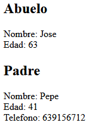
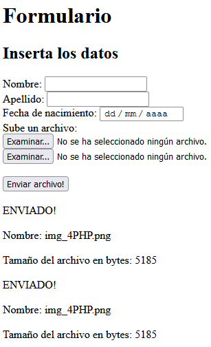

# Respuestas del Examen Práctico

## Ejercicio 4

a) Si, se activan las funciones de la clase padre para demostrarlo en el archivo 4.php encontramos la definicion de la clase padre Abuelo y la definicion de la clase Padre hija de Abuelo.

En la clase Abuelo estan definidos los metodos magicos __get y __set, donde comprueban antes de ejecutarse si la propiedad existe en el objeto instanciado. 

Estos metodos devuelven la propiedad independientemente de si es  privada o protected.

b) No, no afecta en la clase hija que las propiedades sean privadas o protected para demostrarlo en el archivo 4.php
en las pruebas realizadasen lo ultimo del archivo se instancia primero un objeto Abuelo y usamos añadimos por el constructor la propiedad nombre, mediante el metodo magico __set metemos la propiedad $telefono, y con el metodo magico __get la obtenemos y la mostramos en la pantalla.

Después volvemos a repetir la demostracion con lo mismo pero en vez de usar la clase Abuelo para instanciar usamos la clase hija Padre y como podemos observar el comportamiento es igual a su clase padre Abuelo ya que puede acceder a los metodos magicos y los usa.

## Ejercicio 5

Creamos un formulario que muestre los campos nombre, apellido, fecha de nacimiento y dos campos para la subida de archivos.

### El dominio de ejercicios subidos al remoto es:
http://gnovel.ifc33b.cifpfbmoll.eu/dwes_2021-gasparnovel/1eva_respuestas/4.php
http://gnovel.ifc33b.cifpfbmoll.eu/dwes_2021-gasparnovel/1eva_respuestas/5.php