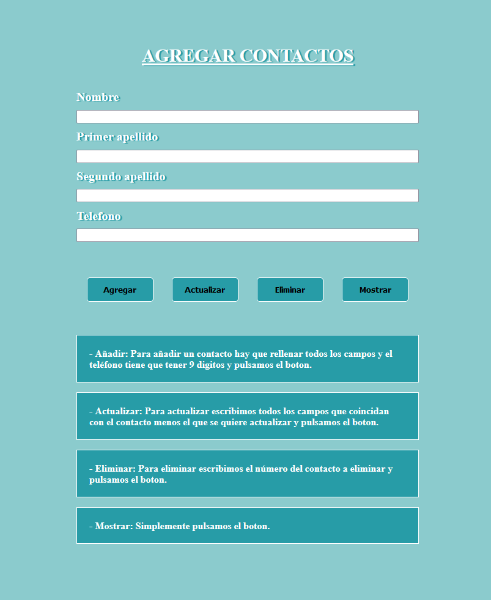
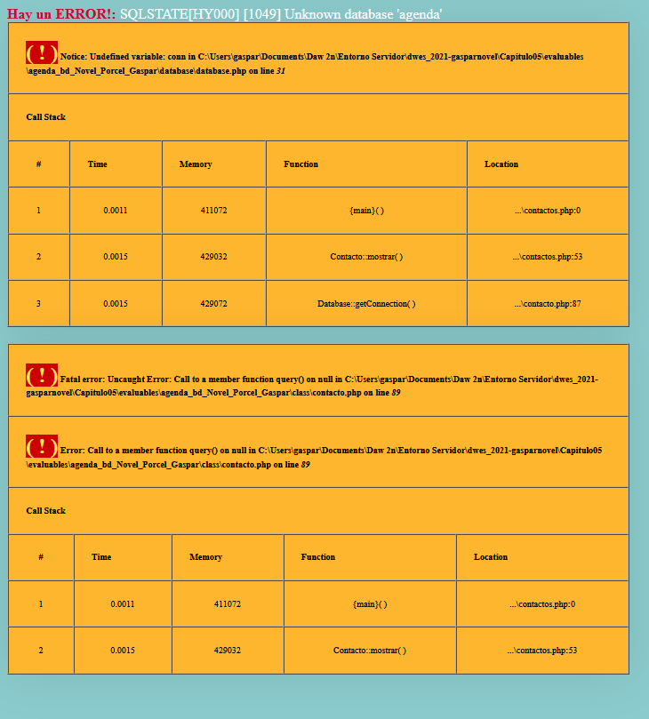

# AGENDA CON BASE DE DATOS MYSQL

## Como Utilizar:

- Añadir: Para añadir un contacto hay que rellenar todos los campos y el teléfono tiene que tener 9 digitos y pulsamos el boton.

- Actualizar: Para actualizar escribimos todos los campos que coincidan con el contacto menos el que se quiere actualizar y pulsamos el boton.

- Eliminar: Para eliminar escribimos el número del contacto a eliminar y pulsamos el boton.

- Mostrar: Simplemente pulsamos el boton.

## Servidor: 
- No he conseguido usar la base de datos en remoto por lo que en local hay que ejecutar query.sql para hacer pruebas.

- Para probar la funcionalidad de la agenda tendriamos que ir al siguiente enlace: [agenda_bd_Novel_Porcel_Gaspar](http://gnovel.ddns.net/Capitulo05/evaluables/agenda_bd_Novel_Porcel_Gaspar/)

## Imagenes del diseño: 

- ### Agregar Contactos:

- ### Contactos:

- ### Excepciones:
